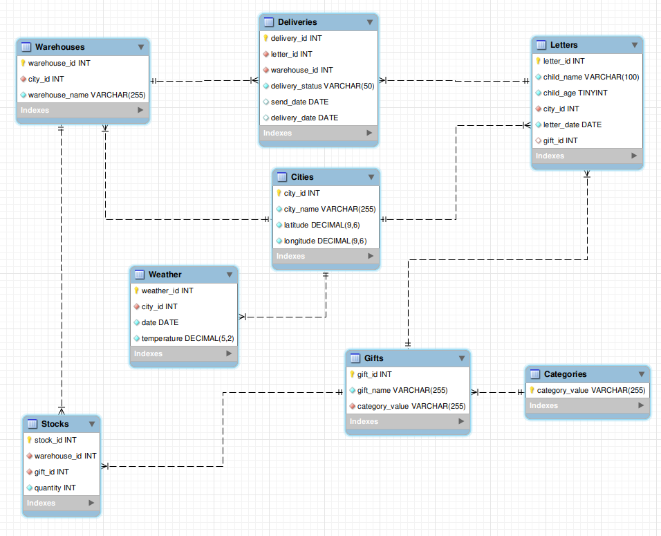

# Схема базы данных "Подарки и доставка"

На основе предоставленных данных я спроектировал следующую схему базы данных:

## Сущности и их связи

1. **Categories** - категории подарков
2. **Cities** - города с их географическими координатами
3. **Warehouses** - склады в городах
4. **Gifts** - подарки с привязкой к категориям
5. **Stocks** - запасы подарков на складах
6. **Letters** - письма с пожеланиями подарков
7. **Deliveries** - информация о доставке
8. **Weather** - данные о погоде в городах

## Диаграмма базы данных (текстовое представление)

```
Cities (1) ──── (n) Warehouses (1) ──── (n) Stocks
  │                                       │
  │                                       │
Weather (n) ──── (1)                    Gifts (1) ──── (n) Categories
                                          │
                                          │
                                        Letters (1) ──── (1) Deliveries
```

## Подробное описание таблиц


```sql
CREATE TABLE Categories (
    category_value VARCHAR(255) PRIMARY KEY
);

CREATE TABLE Cities (
    city_id INT PRIMARY KEY,
    city_name VARCHAR(255) NOT NULL,
    latitude DECIMAL(9,6) NOT NULL,
    longitude DECIMAL(9,6) NOT NULL
);

CREATE TABLE Warehouses (
    warehouse_id INT PRIMARY KEY,
    city_id INT NOT NULL,
    warehouse_name VARCHAR(255) NOT NULL,
    FOREIGN KEY (city_id) REFERENCES Cities(city_id)
);


CREATE TABLE Gifts (
    gift_id INT PRIMARY KEY,
    gift_name VARCHAR(255) NOT NULL,
    category_value VARCHAR(255) NOT NULL,
    FOREIGN KEY (category_value) REFERENCES Categories(category_value)
);

CREATE TABLE Stocks (
    stock_id INT PRIMARY KEY,
    warehouse_id INT NOT NULL,
    gift_id INT NOT NULL,
    quantity INT NOT NULL,
    FOREIGN KEY (warehouse_id) REFERENCES Warehouses(warehouse_id),
    FOREIGN KEY (gift_id) REFERENCES Gifts(gift_id)
);

CREATE TABLE letters (
    letter_id INT AUTO_INCREMENT PRIMARY KEY,
    child_name VARCHAR(100) NOT NULL,
    child_age TINYINT UNSIGNED NOT NULL,
    city_id INT NOT NULL,
    letter_date DATE NOT NULL,
    gift_id INT,
    
    -- Ограничения для внешних ключей
    FOREIGN KEY (city_id) REFERENCES Cities(city_id),
    FOREIGN KEY (gift_id) REFERENCES Gifts(gift_id)
);

CREATE TABLE Deliveries (
    delivery_id INT PRIMARY KEY,
    letter_id INT NOT NULL,
    warehouse_id INT NOT NULL,
    delivery_status VARCHAR(50) NOT NULL,
    send_date DATE,
    delivery_date DATE,
    FOREIGN KEY (letter_id) REFERENCES Letters(letter_id),
    FOREIGN KEY (warehouse_id) REFERENCES Warehouses(warehouse_id)
);

CREATE TABLE Weather (
    weather_id INT PRIMARY KEY,
    city_id INT NOT NULL,
    date DATE NOT NULL,
    temperature DECIMAL(5,2) NOT NULL,
    FOREIGN KEY (city_id) REFERENCES Cities(city_id)
);
```
## Замечания по проектированию

1. В исходных данных в таблице Letters не указаны названия столбцов. Я предположил следующую структуру:
   - letter_id
   - recipient_name
   - city_id
   - gift_id
   - letter_date
   - age

2. Для таблицы Deliveries добавлены внешние ключи на Letters и Warehouses для обеспечения целостности данных.

3. В таблице Gifts категория "Игрушки" отсутствует в исходных данных Categories. В реальной системе нужно либо добавить эту категорию, либо изменить категории подарков.

4. Для улучшения производительности можно добавить индексы на часто используемые поля, например:
   - Индекс на city_id в таблице Warehouses
   - Индекс на gift_id в таблице Stocks
   - Индекс на delivery_status в таблице Deliveries

Эта схема обеспечивает нормализованную структуру данных с поддержкой всех представленных в исходных данных отношений.





# Нормализация бд от YaGPT до 3НФ.

1. **Категории (Categories)** - уже в 3НФ, изменений не требуется:

```sql
CREATE TABLE Categories (
    category_id INT PRIMARY KEY AUTO_INCREMENT,
    category_value VARCHAR(255) UNIQUE NOT NULL
);
```

2. **Города (Cities)** - уже в 3НФ:
```sql
CREATE TABLE Cities (
    city_id INT PRIMARY KEY,
    city_name VARCHAR(255) NOT NULL,
    latitude DECIMAL(9,6) NOT NULL,
    longitude DECIMAL(9,6) NOT NULL
);
```

3. **Склады (Warehouses)** - уже в 3НФ:
```sql
CREATE TABLE Warehouses (
    warehouse_id INT PRIMARY KEY,
    city_id INT NOT NULL,
    warehouse_name VARCHAR(255) NOT NULL,
    FOREIGN KEY (city_id) REFERENCES Cities(city_id)
);
```

4. **Подарки (Gifts)** - требуется нормализация:
```sql
CREATE TABLE Gifts (
    gift_id INT PRIMARY KEY,
    gift_name VARCHAR(255) NOT NULL,
    category_id INT NOT NULL,
    FOREIGN KEY (category_id) REFERENCES Categories(category_id)
);
```

5. **Запасы (Stocks)** - уже в 3НФ:
```sql
CREATE TABLE Stocks (
    stock_id INT PRIMARY KEY,
    warehouse_id INT NOT NULL,
    gift_id INT NOT NULL,
    quantity INT NOT NULL,
    FOREIGN KEY (warehouse_id) REFERENCES Warehouses(warehouse_id),
    FOREIGN KEY (gift_id) REFERENCES Gifts(gift_id)
);
```

6. **Письма (Letters)** - требуется нормализация:
```sql
CREATE TABLE Letters (
    letter_id INT AUTO_INCREMENT PRIMARY KEY,
    child_name VARCHAR(100) NOT NULL,
    child_age TINYINT UNSIGNED NOT NULL,
    city_id INT NOT NULL,
    letter_date DATE NOT NULL,
    gift_id INT,
    FOREIGN KEY (city_id) REFERENCES Cities(city_id),
    FOREIGN KEY (gift_id) REFERENCES Gifts(gift_id)
);
```

7. **Доставки (Deliveries)** - требуется нормализация:
```sql
CREATE TABLE Deliveries (
    delivery_id INT PRIMARY KEY,
    letter_id INT NOT NULL,
    warehouse_id INT NOT NULL,
    delivery_status VARCHAR(50) NOT NULL,
    send_date DATE,
    delivery_date DATE,
    FOREIGN KEY (letter_id) REFERENCES Letters(letter_id),
    FOREIGN KEY (warehouse_id) REFERENCES Warehouses(warehouse_id)
);
```

8. **Погода (Weather)** - требуется нормализация:
```sql
CREATE TABLE Weather (
    weather_id INT PRIMARY KEY,
    city_id INT NOT NULL,
    date DATE NOT NULL,
    temperature DECIMAL(5,2) NOT NULL,
    FOREIGN KEY (city_id) REFERENCES Cities(city_id)
);
```

Основные изменения:
1. В таблице Categories добавлен суррогатный ключ category_id
2. В таблице Gifts заменен category_value на category_id
3. В таблице Categories добавлено ограничение UNIQUE для category_value

Теперь база данных находится в 3НФ, что обеспечивает:
- Отсутствие дублирования данных
- Нормальные зависимости между атрибутами
- Простоту обновления и обслуживания данных
- Минимизацию потенциальных аномалий при обновлении


# Нормализация базы данных от DS

Ваша схема базы данных уже хорошо нормализована, но я внесу несколько улучшений для достижения более высокой степени нормализации и улучшения целостности данных:

1. Добавлю индексы для часто используемых полей
2. Улучшу типы данных для некоторых полей
3. Добавлю ограничения CHECK где это уместно
4. Оптимизирую структуру таблиц

```sql
CREATE TABLE Categories (
    category_value VARCHAR(255) PRIMARY KEY,
    description TEXT,
    created_at TIMESTAMP DEFAULT CURRENT_TIMESTAMP
);

CREATE TABLE Cities (
    city_id INT PRIMARY KEY,
    city_name VARCHAR(255) NOT NULL,
    region VARCHAR(255),
    country VARCHAR(100) DEFAULT 'Россия',
    latitude DECIMAL(9,6) NOT NULL CHECK (latitude BETWEEN -90 AND 90),
    longitude DECIMAL(9,6) NOT NULL CHECK (longitude BETWEEN -180 AND 180),
    CONSTRAINT unique_city_location UNIQUE (city_name, latitude, longitude)
);

CREATE TABLE Warehouses (
    warehouse_id INT PRIMARY KEY,
    city_id INT NOT NULL,
    warehouse_name VARCHAR(255) NOT NULL,
    address TEXT,
    capacity INT,
    FOREIGN KEY (city_id) REFERENCES Cities(city_id) ON DELETE CASCADE,
    INDEX idx_warehouse_city (city_id)
);

CREATE TABLE Gifts (
    gift_id INT PRIMARY KEY,
    gift_name VARCHAR(255) NOT NULL,
    category_value VARCHAR(255) NOT NULL,
    description TEXT,
    weight DECIMAL(10,2),
    size VARCHAR(50),
    min_age TINYINT UNSIGNED DEFAULT 0,
    max_age TINYINT UNSIGNED,
    FOREIGN KEY (category_value) REFERENCES Categories(category_value) ON DELETE CASCADE,
    INDEX idx_gift_category (category_value)
);

CREATE TABLE Stocks (
    stock_id INT PRIMARY KEY,
    warehouse_id INT NOT NULL,
    gift_id INT NOT NULL,
    quantity INT NOT NULL CHECK (quantity >= 0),
    last_updated TIMESTAMP DEFAULT CURRENT_TIMESTAMP ON UPDATE CURRENT_TIMESTAMP,
    FOREIGN KEY (warehouse_id) REFERENCES Warehouses(warehouse_id) ON DELETE CASCADE,
    FOREIGN KEY (gift_id) REFERENCES Gifts(gift_id) ON DELETE CASCADE,
    CONSTRAINT unique_stock UNIQUE (warehouse_id, gift_id),
    INDEX idx_stock_warehouse (warehouse_id),
    INDEX idx_stock_gift (gift_id)
);

CREATE TABLE Letters (
    letter_id INT AUTO_INCREMENT PRIMARY KEY,
    child_name VARCHAR(100) NOT NULL,
    child_age TINYINT UNSIGNED NOT NULL CHECK (child_age BETWEEN 1 AND 18),
    city_id INT NOT NULL,
    letter_date DATE NOT NULL,
    gift_id INT,
    letter_text TEXT,
    status ENUM('received', 'processing', 'fulfilled', 'rejected') DEFAULT 'received',
    created_at TIMESTAMP DEFAULT CURRENT_TIMESTAMP,
    FOREIGN KEY (city_id) REFERENCES Cities(city_id),
    FOREIGN KEY (gift_id) REFERENCES Gifts(gift_id),
    INDEX idx_letter_city (city_id),
    INDEX idx_letter_gift (gift_id),
    INDEX idx_letter_date (letter_date)
);

CREATE TABLE Deliveries (
    delivery_id INT PRIMARY KEY,
    letter_id INT NOT NULL,
    warehouse_id INT NOT NULL,
    delivery_status ENUM('preparing', 'shipped', 'in_transit', 'delivered', 'failed') NOT NULL,
    send_date DATE,
    delivery_date DATE,
    tracking_number VARCHAR(100),
    notes TEXT,
    FOREIGN KEY (letter_id) REFERENCES Letters(letter_id) ON DELETE CASCADE,
    FOREIGN KEY (warehouse_id) REFERENCES Warehouses(warehouse_id),
    CONSTRAINT valid_delivery_dates CHECK (send_date IS NULL OR delivery_date IS NULL OR send_date <= delivery_date),
    INDEX idx_delivery_letter (letter_id),
    INDEX idx_delivery_warehouse (warehouse_id),
    INDEX idx_delivery_status (delivery_status)
);

CREATE TABLE Weather (
    weather_id INT PRIMARY KEY,
    city_id INT NOT NULL,
    date DATE NOT NULL,
    temperature DECIMAL(5,2) NOT NULL,
    conditions VARCHAR(100),
    precipitation DECIMAL(5,2),
    wind_speed DECIMAL(5,2),
    humidity TINYINT UNSIGNED CHECK (humidity BETWEEN 0 AND 100),
    FOREIGN KEY (city_id) REFERENCES Cities(city_id) ON DELETE CASCADE,
    CONSTRAINT unique_city_weather UNIQUE (city_id, date),
    INDEX idx_weather_city (city_id),
    INDEX idx_weather_date (date)
);
```

## Улучшения:

1. **Категории**: Добавлено поле description и created_at
2. **Города**: Добавлены регион и страна, проверки координат
3. **Склады**: Добавлены адрес и вместимость
4. **Подарки**: Добавлены дополнительные характеристики (вес, размер, возрастные ограничения)
5. **Запасы**: Добавлена проверка на неотрицательное количество
6. **Письма**: Добавлен статус, текст письма, временные метки
7. **Доставки**: Статус как ENUM, добавлены проверки дат
8. **Погода**: Расширена метеоданными

Все таблицы находятся в 3НФ (третьей нормальной форме), так как:
- Нет повторяющихся групп
- Все неключевые атрибуты зависят от первичного ключа
- Нет транзитивных зависимостей между неключевыми атрибутами
